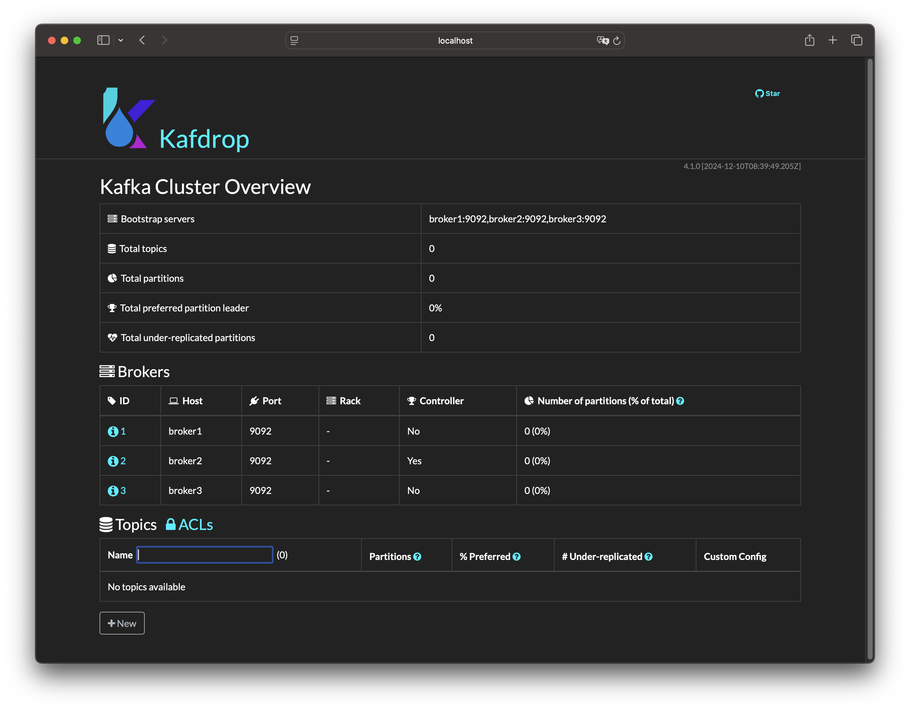

# Kafka Cluster Docker Compose Setup


## Overview
This setup provides a Kafka cluster using KRaft mode (ZooKeeper-free) with 3 brokers. Each broker is configured as both a broker and a controller, using plaintext communication and supporting automatic topic replication.

```
+------------------ +        +-------------------+        +------------------+
|   Kafka Broker 1  |        |   Kafka Broker 2  |        |   Kafka Broker 3 |
|   (Container 1)   |        |   (Container 2)   |        |   (Container 3)  |
| 9092, 9093, 19092 | <----> | 9092, 9093, 19093 | <----> | 9092, 9093, 19094|
+-------------------+        +-------------------+        +------------------+
        |                            |                             |
        +----------------------------+-----------------------------+
                                     |
                             +-----------------+
                             |  Docker Network |
        +------------------> |    (kafka-net)  |
        |                    +-----------------+
        |                            |
        |                            |
        |                            |
        |                            |
+------------------+                 |
|     Kafdrop      |                 |
|   (Container 4)  |                 |
|       8080       |                 |
+------------------+                 |
                                     |
                                     |
                                     |
                             +----------------+
                             |  Docker Host   |
                             | broker1: 19092 |
                             | broker2: 19093 |
                             | broker3: 19094 |
                             | kafdrop: 19000 |
                             +----------------+
```

## Checking Out the Repository
To clone the repository, use the following command:
```bash
git clone git@github.com:luismr/kafka-cluster-docker-compose.git
```

## Setting Up the Network
Before starting the Kafka cluster, ensure the `kafka-net` network is created. You can create it manually with:
```bash
docker network create kafka-net
```

## Setting the KAFKA_CLUSTER_ID

The `KAFKA_CLUSTER_ID` is a crucial environment variable for setting up the Kafka cluster in KRaft mode. You can set this variable in two ways:

### Using an .env File
1. Rename the `.env.example` file to `.env`.
2. Open the `.env` file and set the `KAFKA_CLUSTER_ID` variable:
   ```
   KAFKA_CLUSTER_ID=your-unique-cluster-id
   ```
3. Save the file. Docker Compose will automatically load this file and use the variable when starting the containers.

### Setting Environment Variables Directly
Alternatively, you can set the `KAFKA_CLUSTER_ID` as an environment variable in your operating system:

#### On Windows
```cmd
set KAFKA_CLUSTER_ID=your-unique-cluster-id
```

#### On Linux/Mac
```bash
export KAFKA_CLUSTER_ID=your-unique-cluster-id
```

After setting the environment variable, you can start the Kafka cluster with Docker Compose:
```bash
docker-compose up -d
```

## Configuration
- **KAFKA_KRAFT_CLUSTER_ID**: Unique identifier for the Kafka cluster.
- **KAFKA_NODE_ID**: Unique ID for each broker.
- **KAFKA_PROCESS_ROLES**: Configures the broker to act as both a broker and a controller.
- **KAFKA_LISTENERS**: Defines the internal and external listeners for each broker.
- **KAFKA_LISTENER_SECURITY_PROTOCOL_MAP**: Specifies the security protocol for each listener (plaintext).
- **KAFKA_INTER_BROKER_LISTENER_NAME**: Specifies the listener used for inter-broker communication.
- **KAFKA_CONTROLLER_LISTENER_NAMES**: Specifies the listener used for controller communication.
- **KAFKA_ADVERTISED_LISTENERS**: Advertises the listener addresses for client connections.
- **KAFKA_LOG_DIRS**: Directory where Kafka logs are stored.
- **KAFKA_OFFSETS_TOPIC_REPLICATION_FACTOR**: Sets the replication factor for the offsets topic.
- **KAFKA_TRANSACTION_STATE_LOG_REPLICATION_FACTOR**: Sets the replication factor for the transaction state log.
- **KAFKA_TRANSACTION_STATE_LOG_MIN_ISR**: Minimum in-sync replicas for the transaction state log.

## Running the Kafka Cluster
To start the Kafka cluster, use the following command:
```bash
docker-compose up -d
```
This command will start all the services defined in the `docker-compose.yml` file in detached mode.

## Connecting to the Kafka Cluster

You can connect to the Kafka cluster using various client libraries. Below is an example using Python with the `kafka-python` library.

### Python Example

First, install the `kafka-python` library:

```bash
pip install kafka-python
```

Then, use the following script to produce and consume messages:

```python
from kafka import KafkaProducer, KafkaConsumer

# Producer
producer = KafkaProducer(bootstrap_servers=['localhost:19092', 'localhost:19093', 'localhost:19094'])
producer.send('my-topic', b'Hello, Kafka!')
producer.flush()

# Consumer
consumer = KafkaConsumer('my-topic', bootstrap_servers=['localhost:19092', 'localhost:19093', 'localhost:19094'])
for message in consumer:
    print(f"Received message: {message.value.decode('utf-8')}")
```

This example connects to the Kafka brokers running on `localhost:19092`, `localhost:19093`, and `localhost:19094`, sends a message to `my-topic`, and then consumes messages from the same topic.

## Stopping the Kafka Cluster
To stop the Kafka cluster, use the following command:
```bash
docker-compose down
```
This command will stop and remove all the containers defined in the `docker-compose.yml` file.

## Removing the Kafka Cluster
To remove the Kafka cluster and its associated volumes, use the following command:
```bash
docker-compose down -v
```
This command will stop the containers and remove the volumes, ensuring that all data is deleted.

## Adding New Nodes
To add a new broker node:
1. Copy the configuration of an existing broker in the `docker-compose.yml` file.
2. Update the `KAFKA_NODE_ID` and listener ports to unique values.
3. Add the new broker service to the `docker-compose.yml`.

## Contributing
To contribute to this project:
1. Fork the repository on GitHub.
2. Create a new branch for your feature or bug fix.
3. Commit your changes and push them to your fork.
4. Submit a pull request to the main repository.

We welcome contributions and improvements to this setup!

## Kafka Management UI with Kafdrop

Kafdrop is a web-based user interface that allows you to manage and monitor your Kafka cluster. It provides insights into your Kafka topics, partitions, and consumer groups.

### Accessing Kafdrop



Kafdrop is configured to run on port 19000. You can access it by navigating to [http://localhost:19000](http://localhost:19000) in your web browser.

### Features of Kafdrop

- **Topic Management**: View and manage Kafka topics and partitions.
- **Consumer Groups**: Monitor consumer group offsets and lag.
- **Broker Information**: Get detailed information about the brokers in your cluster.
- **Message Browsing**: Browse messages in your Kafka topics.

### Running Kafdrop

Ensure that Kafdrop is included in your `docker-compose.yml` and is running alongside your Kafka brokers. Here is an example service definition for Kafdrop:

```yaml
services:
  kafdrop:
    image: obsidiandynamics/kafdrop
    container_name: kafdrop
    ports:
      - "19000:9000"
    environment:
      KAFKA_BROKERCONNECT: "broker1:9092,broker2:9092,broker3:9092"
    networks:
      - kafka-net
```

This configuration exposes Kafdrop on port 19000 and connects it to your Kafka brokers via the `kafka-net` network.

## License

This project is licensed under the MIT License. See the [LICENSE.md](LICENSE.md) file for more details. 